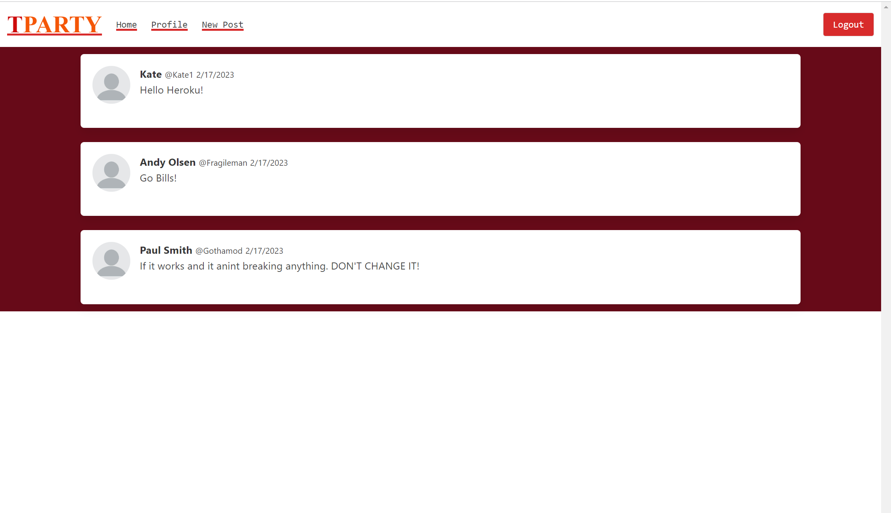
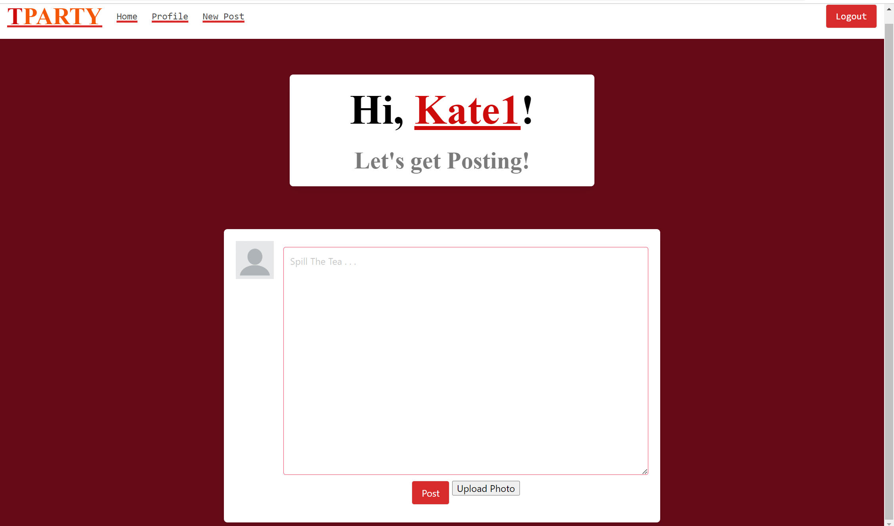
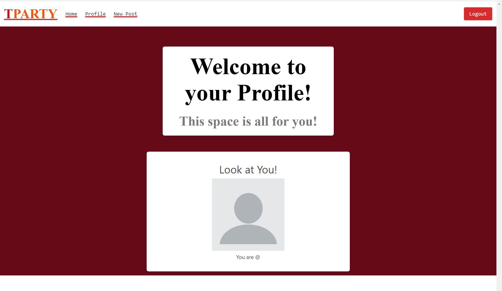

# The Tea Party a Developers Brew
## Description
We wanted to make an place where developers, coders, and anyone else could come to get
help and colaberation in projects and groups. To also share luaghs and vent away the pain.
A cafe on the internet.

## Usage
A place for developers experienced and not to collaperate and get advice on projects,
to vent about issues with the code, and to post silly pictures and memes of any and all
things relayted to code. 
As well as eventually a place to see if a job is a good enviorment or a black company to work for.

## Images

## Links
Deployed- https://pure-chamber-11978.herokuapp.com/

Git Hub repository- https://github.com/Ksteed8859/Tea-Party

## Credits
Kate Steed- https://github.com/Ksteed8859
Andrew Olsen-https://github.com/AndyOlsen1295
Anthony Angelos- https://github.com/Anthonyshakurangelos
Joshua Lucas- https://github.com/JoshuaLucas212
Paul Smith- https://github.com/Gothamod

## Mentions.
Shout out to the TA's for their awsome and insightful help.
Q for his teaching Skills.

## Licenses
N/A